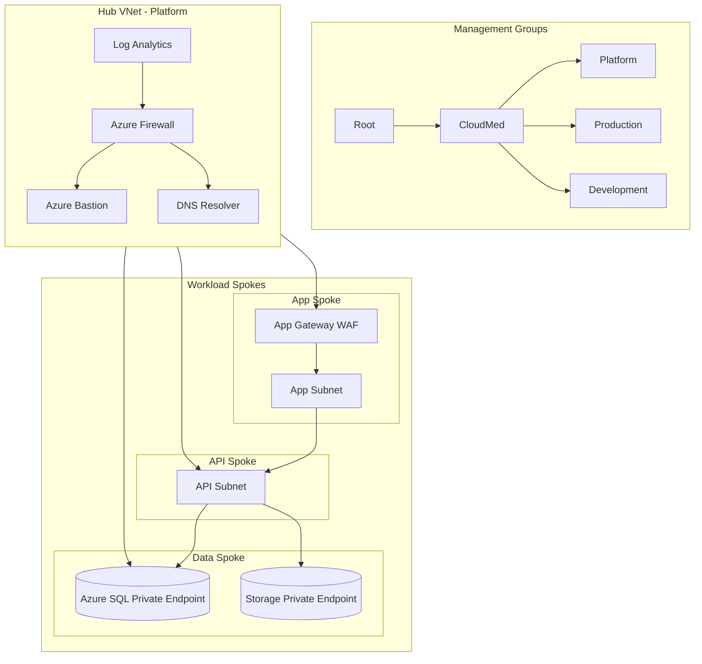

# Lab 10 - Zero Trust Landing Zone for CloudMed Solutions

## 1. Company Overview

CloudMed Solutions is a health care technology company that supports hospitals and clinics across Canada, the United States, and Europe. The company focuses on making online medical care easier and safer. Their main product is MedConnect, which allows patients and doctors to talk online, store medical records, and use AI tools to understand health data.

Because CloudMed works with very private patient information, the company must follow strict laws like HIPAA, GDPR and PIPEDA. These rules protect personal health information. Since CloudMed handles sensitive data in multiple countries, using Azure with a Zero Trust model is very important. Zero Trust means never trust anyone or anything by default and always verify identity and access.

---

## 2. Governance and Identity

### Management Group Structure

Root  
CloudMed  
Platform  
Production  
Development  

This structure keeps everything organized and helps apply policies and controls at the right level.

### Governance Plan

**RBAC Access**
- Admins have platform-level access  
- DevOps works mainly in development  
- Finance only has billing and cost access  

This reduces the chance of mistakes or unauthorized access.

**Azure Policy**
- Only Canada Central and West Europe regions are allowed  
- Every resource must have tags like CostCenter, Owner and Environment  
- Policies make sure encryption is always enabled and sensitive resources cannot be public  

**Identity**
- CloudMed uses Azure Entra ID  
- MFA and Conditional Access add extra layers of security  
- PIM gives admin access only for a short time  
- Managed identities help apps authenticate without storing passwords  

---

## 3. Network Architecture

CloudMed uses a Hub and Spoke network design. This keeps security tools in one central place while separating workloads into different spokes.

### Hub VNet includes:
- Azure Firewall  
- Azure Bastion  
- DNS Resolver  
- Log Analytics workspace  

The Hub acts like the main control center for security and monitoring.

### Spoke VNets include:
- App Spoke for the web front end  
- API Spoke for backend services  
- Data Spoke for SQL databases and Storage accounts  

The Data Spoke uses Private Endpoints so data never goes to the public internet. NSGs and Firewall rules help control traffic. Spokes never talk directly to each other without going through the Hub, which adds extra protection.

---

## 4. Zero Trust Controls

### Verify Explicitly
- Always check identity  
- Use MFA and Conditional Access  
- Use certificates and managed identities  

### Least Privilege Access
- Use RBAC correctly  
- Give only the minimum access needed  
- Use PIM for short-term admin access  

### Assume Breach
- Separate networks to limit movement  
- Encrypt everything  
- Enable logs and monitoring  
- Use private endpoints  
- Control east to west traffic  

### Design Examples
1. Azure Bastion for secure admin access  
2. Private Link for SQL and Storage  
3. Deny public IPs in data subnets  
4. WAF on Application Gateway  
5. Just In Time VM access  

---

## 5. Monitoring, Compliance and Cost

### Monitoring

- CloudMed uses several Azure tools to keep an eye on everything happening in the environment. Log Analytics collects logs from all resources so the team can see what is going on across the entire system. 
- Defender for Cloud gives security recommendations and alerts the team if something looks unsafe. 
- Microsoft Sentinel is used for SIEM and threat detection, which helps find suspicious activity or attacks. 
- On top of that, alerts are set up so the team gets notified right away if anything unusual happens.

### Compliance  

- To stay compliant with laws like HIPAA, GDPR, and PIPEDA, CloudMed uses Azure Policy sets. These policies automatically check if resources are following company and legal requirements.
- Defender for Cloud also shows a compliance score and highlights areas that need improvement. 
- The environment is designed so that all sensitive data remains only in approved regions, which helps meet data residency rules.

### Cost
 
- CloudMed manages costs by using tags to keep track of which team or project owns each resource. 
- Budgets and alerts help prevent overspending by warning the team when they are getting close to their limits. 
- Development resources shut down automatically when they are not being used, which helps save money. 
- Autoscaling is also used so resources scale up only when needed and scale down when demand is low, reducing unnecessary costs.

---

## 6. Conceptual Diagram

## Diagram Summary

The diagram shows how CloudMed's Zero Trust Azure Landing Zone is structured. It has three main parts: Management Groups, the Hub VNet, and the Spoke VNets.

### 1. Management Groups
These groups help organize all Azure resources and make it easier to apply policies and access rules.  
The groups shown in the diagram are:
- Root  
- CloudMed  
- Platform  
- Production  
- Development  

### 2. Hub VNet
The Hub VNet is the central place for shared security and management services.  
It includes:
- Azure Firewall  
- Azure Bastion for secure admin access  
- DNS Resolver  
- Log Analytics for monitoring  

All traffic going in and out of the spokes passes through the Hub for inspection and logging.

### 3. Spoke VNets
Each spoke holds a different part of the application. They are separated to increase security.

- **App Spoke**  
  Contains the Application Gateway with WAF and the app subnet.
  
- **API Spoke**  
  Hosts backend API services.

- **Data Spoke**  
  Contains Azure SQL and Storage using Private Endpoints so no data goes to the public internet.

### How Zero Trust is Applied

Azure Firewall filters all the traffic moving in and out of the network to make sure everything is safe. Private Endpoints are used so the databases and storage accounts stay private and never go to the public internet. For admin access, Bastion is used instead of opening RDP or SSH ports, which adds another layer of security. Logging and monitoring are always turned on so the team can track activities and catch any issues early. The spoke networks are kept separate and cannot talk to each other directly, which helps limit risks and prevents attackers from moving around inside the environment.

## Recommendations

One recommendation I would give is to start using automation tools like Terraform or Bicep for building the landing zone. Right now everything is designed manually, but if CloudMed automates it, the whole setup becomes easier to manage and more consistent. It also saves time because the same configuration can be reused for other environments or regions without redoing everything.

Another recommendation is to focus more on cost optimization using FinOps practices. This means checking cloud spending regularly, looking for resources that are not being used, and using things like reserved instances or savings plans where it makes sense. By doing this, CloudMed can reduce unnecessary costs while still keeping all their applications running smoothly and securely.

## Conclusion

This Zero Trust Landing Zone design gives CloudMed Solutions a secure and well-organized Azure environment. It protects sensitive patient data by verifying identity, limiting access, and isolating workloads. The Hub and Spoke network helps control traffic, while private endpoints and firewall rules keep resources safe from the public internet.

With strong monitoring tools like Log Analytics, Defender for Cloud, and Sentinel, CloudMed can quickly detect and respond to issues. Cost controls such as tagging, budgets, and autoscaling help keep cloud spending under control.

Overall, this design supports CloudMed’s security, compliance, and performance needs. It also creates a strong foundation that the company can grow in the future by adding automation, more regions, or extra security features.
