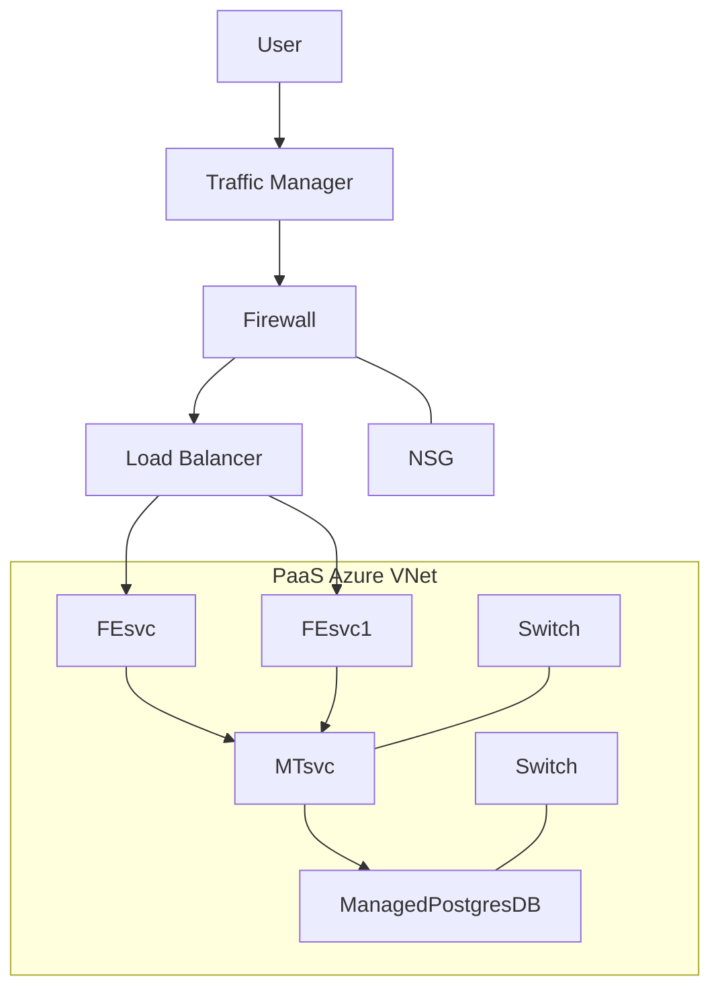
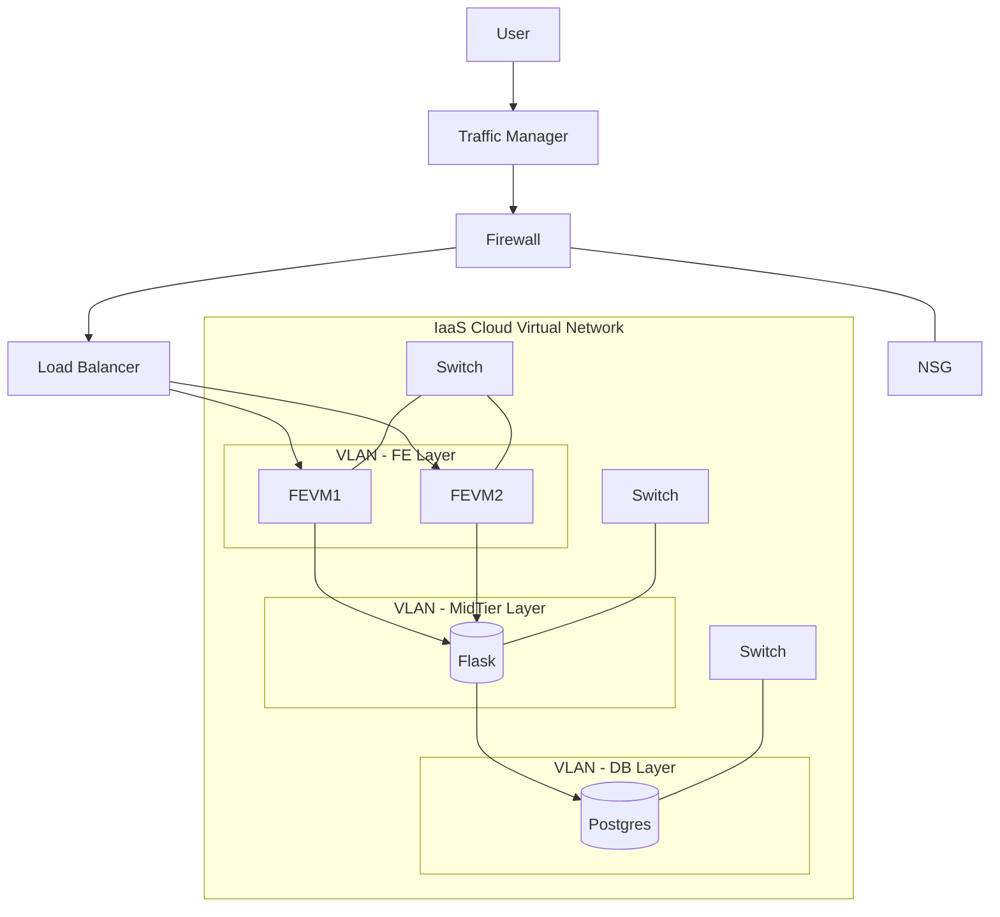
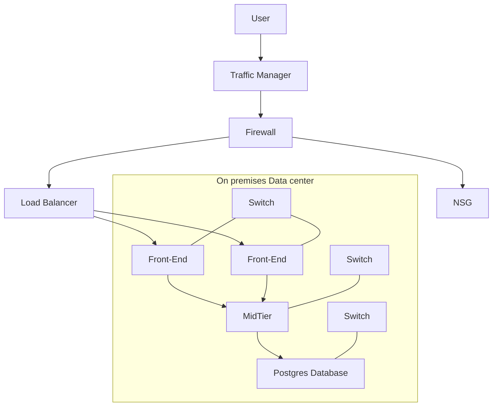

# Lab 2 - IaaS/PaaS architecture
## Name: Rohan Yogesh Surti (surt0008)
## Scenario: The following application consists of a Web Server written in Flask. A UI front end written in React. A database layer consisting of Postgres.
## PaaS
In PaaS, we don’t use VMs directly. Instead, the React front-end runs as a Web App service (FEsvc, FEsvc1). The Flask backend also runs as a Web App service (MTsvc). The Postgres database is a managed Postgres DB service provided by the cloud. The cloud provider takes care of patching, scaling, and updates.

The diagram shows users sending requests through the Traffic Manager, then through a Firewall, and then to a Load Balancer. The load balancer sends traffic to two front-end services (FEsvc, FEsvc1). These connect to the mid-tier Flask service (MTsvc), which then connects to a managed Postgres database. All of them run inside a virtual network (VNet), with switches linking services.

## IaaS:
In IaaS, we use virtual machines for everything. The React front-end runs on two VMs (FEVM1 and FEVM2). The Flask backend runs on another VM (MTVM). The Postgres database runs on a separate VM (DBVM). We connect them inside a virtual network, and they are split into different VLANs (front-end, mid-tier, and database). We have to manage the operating systems, updates, and scaling ourselves.

The diagram shows users sending requests through a Traffic Manager, then through a Firewall, and then to a Load Balancer. The load balancer sends traffic to the two front-end VMs. These talk to the mid-tier VM running Flask, which then talks to the Postgres database VM. Switches connect the VMs inside VLANs to keep traffic organized and secure.

### On-prem
In an on-premises setup, everything is managed in our own data center. Users’ requests go through Traffic Manager, Firewall, and Load Balancer to front-end servers, then to the mid-tier Flask servers, and finally to the Postgres database server. Physical network switches connect all the layers. We are responsible for everything like servers, operating systems, databases, security, updates, and backups. This gives us full control, but we have to work more and it is harder to scale compared to cloud options.

