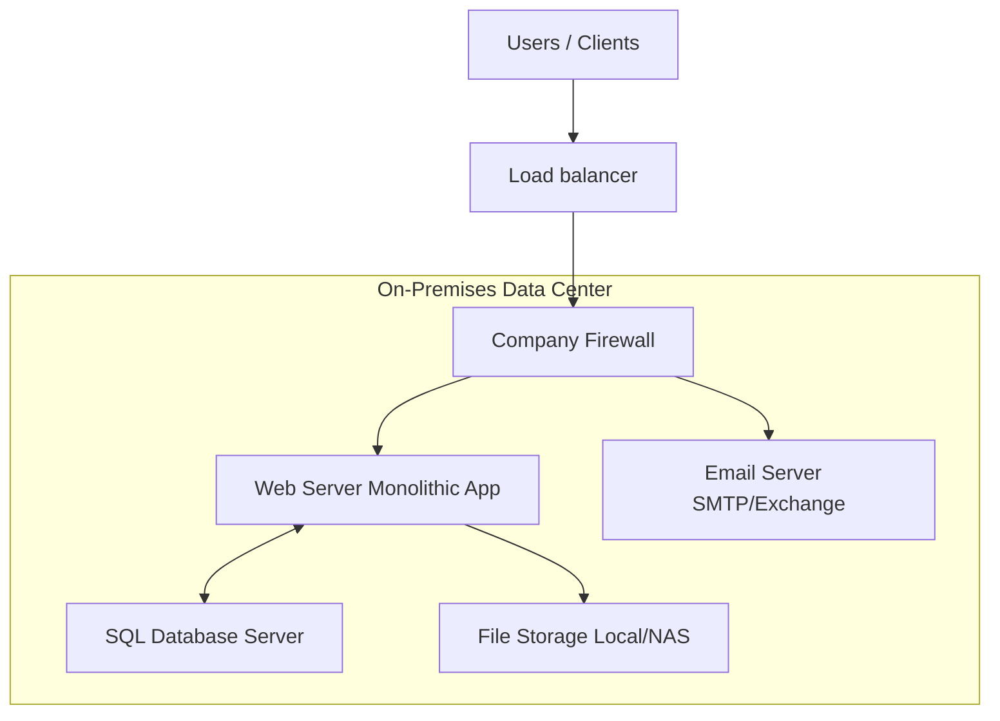

# Cloud Migration and Cloud Adoption – Comparative Study of PaaS, IaaS, and SaaS Across Cloud Providers

### Name: Rohan Surti (surt0008) [041164260]

# Section 1 - On-Premises Solution Design

### On-Premises architecture diagram

### Key components to migrate

* **Web Application (Monolith)** - PaaS (App Service / App Engine) .
On-premises physical servers are costly to maintain, lack elasticity, and cannot easily scale during peak retail periods. Migrating to PaaS improves scalability, availability, and reduces maintenance overhead.

* **Database (SQL Server)** - IaaS (SQL Server on Cloud VM) .
Instead of using a managed DB, the SQL server is replicated to a VM in the cloud. This preserves full admin control, OS-level access, and compatibility with existing apps. Backup and failover policies are applied in the cloud.

* **File Storage** - Cloud Object Storage .
On-premises file storage has limited capacity, requires hardware expansion, and lacks global accessibility. Migrating to cloud object storage provides virtually unlimited storage, high durabilit. 

* **Networking** - SaaS Cloud-Native Networking (VNet / VPC with Firewalls & Load Balancers)  .
On-prem networking requires manual configuration, physical devices, and scaling limitations. Cloud-native networking offers software-defined networks with built-in firewalls, load balancing, and hybrid connectivity options.

* **Email** - SaaS  .
In-house SMTP servers face reliability and deliverability challenges, as well as ongoing patching requirements. Migrating to SaaS email improves deliverability, scales with demand, and eliminates maintenance overhead.

# Section 2 - Migration Strategies

## Overview
The retail company is moving from on-premises infrastructure to the cloud using a **hybrid migration strategy**.  
- Some components will be migrated quickly with minimal changes (*Lift-and-Shift*).  
- Others will be modernized to take advantage of cloud benefits (*Replatforming* or *Refactoring*).  
- The migration will be phased to reduce risk and ensure smooth transition.  

---

## Migration Strategy by Component

### 1. Web Application (Monolithic)
* **Target Service:** Start on **IaaS VM**, later modernize to **PaaS (App Service / Elastic Beanstalk / App Engine)**.  
* **Strategy:**  
  - Step 1: *Lift-and-Shift* the web app to a VM to ensure quick migration with minimal code changes.  
  - Step 2: *Refactor* over time to PaaS for scalability, auto-patching, and easier deployment.  
* **Reasoning:** This reduces downtime during migration and creates a path for modernization later.

---

### 2. Database (SQL Server)
* **Target Service:** **IaaS (VM running SQL Server)**.  
* **Strategy:**  
  - Step 1: Provision a cloud VM with the same SQL Server version.  
  - Step 2: Use database replication or backup/restore for migration.  
  - Step 3: Test application connectivity to confirm integration.  
* **Reasoning:** IaaS ensures full administrative control and application compatibility, while meeting professor’s requirement.

---

### 3. File Storage (Local/NAS)
* **Target Service:** **PaaS (Object Storage: Azure Blob / AWS S3 / GCS Storage)**.  
* **Strategy:**  
  - Step 1: Set up cloud storage buckets.  
  - Step 2: Bulk upload files using migration tools .  
  - Step 3: Update applications to point to new cloud endpoints.  
* **Reasoning:** Cloud object storage provides unlimited capacity, redundancy, and easy global access.

---

### 4. Networking (Routers, Firewalls, Load Balancing)
* **Target Service:** **Cloud-Native Networking (Virtual Network, Firewalls, Load Balancers, VPN Gateways)**.  
* **Strategy:**  
  - Step 1: Create Virtual Network (VNet/VPC) in the cloud.  
  - Step 2: Configure subnets, routing, and firewall rules similar to on-premises.  
  - Step 3: Add hybrid connectivity (VPN/Direct Connect) if needed.  
* **Reasoning:** Cloud-native networking offers elasticity, built-in security, and integration with all other services.

---

### 5. Email Services (SMTP/Exchange)
* **Target Service:** **SaaS (Microsoft 365 / Google Workspace / Amazon WorkMail)**.  
* **Strategy:**  
  - Step 1: Set up SaaS email accounts for employees.  
  - Step 2: Migrate old mailboxes using supported migration tools.  
  - Step 3: Update DNS MX records to point to new service.  
* **Reasoning:** Email is not business-unique, so SaaS eliminates server maintenance while improving spam filtering and uptime.

---

## Detailed Migration Steps (High-Level Timeline)

### Phase 1 – Preparation
* Assess current on-prem architecture.  
* Identify dependencies (web app → database, app → file storage, email → DNS).  
* Define migration order.  
* Choose cloud provider and services.  

---

### Phase 2 – Networking Setup
* Create Virtual Network (VNet/VPC) in cloud.  
* Configure firewall rules and security groups.  
* Set up VPN or ExpressRoute for hybrid connection.  
* Test network latency and access control.  

---

### Phase 3 – Database Migration (IaaS)
* Provision cloud VM with SQL Server installed.  
* Perform schema and data migration using replication or backup.  
* Validate data integrity after migration.  
* Update connection strings in test environment.  

---

### Phase 4 – Web Application Migration
* Deploy application to VM (IaaS) using existing binaries.  
* Configure environment (OS patches, runtime, libraries).  
* Connect app with cloud database (IaaS SQL).  
* Test end-to-end functionality.  
* Future Step: Break monolith into microservices and move to PaaS.  

---

### Phase 5 – File Storage Migration
* Set up object storage (Blob/S3/GCS).  
* Upload files via migration tools or sync services.  
* Change application configuration to point to cloud storage endpoint.  
* Validate file access and permissions.  

---

### Phase 6 – Email Migration
* Create SaaS email accounts for all users.  
* Migrate old emails using IMAP/Exchange migration tools.  
* Update DNS MX records for new service.  
* Test sending and receiving emails.  

---

### Phase 7 – Optimization & Monitoring
* Enable monitoring tools (CloudWatch, Azure Monitor, Stackdriver).  
* Configure alerts for performance and security.  
* Apply autoscaling for web application (if moved to PaaS).  
* Optimize costs using reserved instances or storage tiers.  

---

## Summary

The company is migrating from on-premises to the cloud using a hybrid strategy that balances quick lift-and-shift with gradual modernization.  
The web app starts on IaaS for speed, with a plan to refactor into PaaS later for scalability.  The database stays on IaaS to preserve admin control and meet requirements.  File storage moves to cloud object storage for unlimited, redundant, and globally accessible capacity.  

Email and networking are shifted to SaaS and cloud-native solutions, reducing maintenance while enhancing security and reliability.
