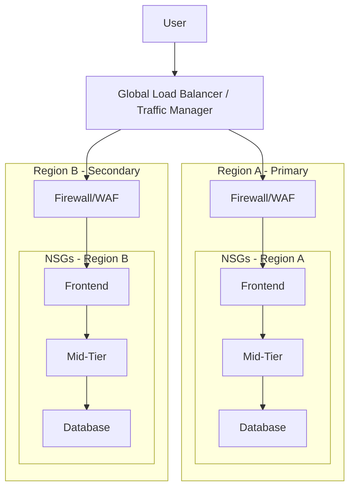

# Lab 04 - Design Rehosting Migration V1
## Name: Rohan Yogesh Surti (surt0008)[041164260]

## Solution diagram showing the target architecture

## Description of Target Architecture 

In this design, the application is deployed in two regions: Region A (Primary) and Region B (Secondary).  

- **User - Global Load Balancer (GLB):**  
  All user requests first go to the Global Load Balancer, which decides which region to send traffic to based on availability.  

- **Regional Firewall/WAF:**  
  Each region has a firewall or Web Application Firewall (WAF). This protects against malicious traffic and enforces security before requests enter the system.  

- **NSGs (Network Security Groups):**  
  Inside each region, traffic is filtered at every subnet level:  
  - **Frontend subnet (FE):** Only allows HTTP/HTTPS traffic from the firewall.  
  - **Mid-Tier subnet (MT):** Only accepts traffic from the frontend subnet.  
  - **Database subnet (DB):** Only accepts traffic from the mid-tier subnet.  

- **Redundancy & Failover:**  
  - The frontend and mid-tier VMs use zone-redundant SSDs to keep them running even if one zone fails.    
  - If Region A goes down, the Global Load Balancer automatically redirects all user requests to Region B.  

## Migration Steps

### Step 1: Replication of Virtual Machines
1. Identify existing WebServerVM (frontend) and SQLVM (database).  
2. Replicate the WebServerVM into both Region A and Region B, using ZRS disks for durability.  
3. Deploy SQLVM in Region A and enable geo-replication to Region B with Premium SSD (GRS).  
4. Verify that both regions have a complete copy of the frontend, mid-tier, and database layers.  

---

### Step 2: Configure Load Balancers
1. Set up a Global Load Balancer (GLB) to distribute traffic between Region A and Region B.  
2. Configure regional firewalls/WAFs to secure inbound requests.  
3. Ensure health probes are set up so if Region A fails, traffic automatically moves to Region B.  

---

### Step 3: Implement Database Replication and Failover
1. Enable SQL Always On Availability Groups or replication between Region A’s DB and Region B’s DB.  
2. Configure automatic failover policies, so Region B takes over if Region A becomes unavailable.    

---

### Step 4: Apply Security Controls
1. Attach NSGs to each subnet:  
   - Frontend - allow only HTTP/HTTPS from firewall.  
   - Mid-Tier - allow only internal traffic from frontend.  
   - Database - allow only traffic from mid-tier.  
2. Deploy firewall/WAF in front of each region’s entry point.  

---

### Step 5: Validate and Test
1. Run end-to-end testing of the application in Region A.  
2. Simulate downtime in Region A to confirm the Global Load Balancer redirects traffic to Region B.  
3. Validate database replication and automatic failover.  
4. Ensure total downtime is kept under 6 hours (business requirement).  

---
